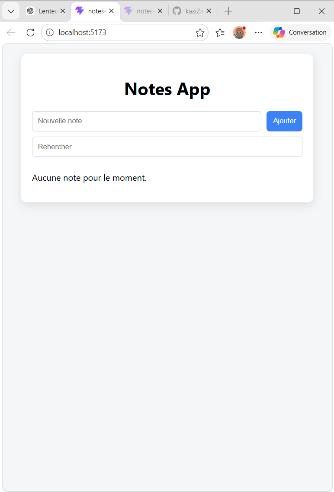

# 📝 Notes App (React)

Application de prise de notes développée avec React dans le cadre de mon apprentissage du développement front-end.

## 🚀 Fonctionnalités

- Ajouter une note
- Supprimer une note
- Modifier une note avec double-clic
- Suppression automatique si le texte est vide
- Recherche en temps réel
- Sauvegarde des notes avec localStorage

## 🛠️ Technologies utilisées

- React (useState, useEffect)
- JavaScript (ES6)
- HTML / CSS
- Vite
- Git / GitHub

## ▶️ Lancer le projet

```bash
npm install
npm run dev
```

## 📸 Aperçu


